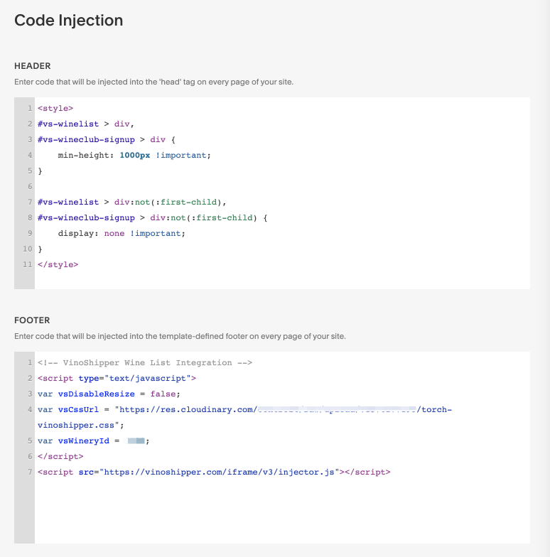

# Torch Cellars
We created a very nice looking website for [Torch Cellars](www.torchcellsars.com) that serves as their business card, their wine portfolio, and their eCommerce website hosted on SquareSpace.com for the frontend and VinoShippers.com for eCommerce. While this was a quick project, we ran into some interesting problems getting SquareSpace and VinoShippers to place nicely. Below, we will document some of the snags we hit and how we overcame them.

## VinoShippers Documentation
Vinoshippers have some very decent documentation regarding how best to implement the cart and checkout logic on multiple platforms including SquareSpace.com.

### Overriding VinoShippers Styling

#### Code Injection in SquareSpace
- Go to *Settings* > *Advanced* > *Code Injection*
- From here you can add your styling overrides. For us, they looked like the following.
- In the **Header** section we used the following.
```
<style>
#vs-winelist > div,
#vs-wineclub-signup > div {
	min-height: 1000px !important;
}

#vs-winelist > div:not(:first-child),
#vs-wineclub-signup > div:not(:first-child) {
	display: none !important;
}
</style>
```
- In the Footer section we used the following.
```
<!-- VinoShipper Wine List Integration -->
<script type="text/javascript">
var vsDisableResize = false;
var vsCssUrl = "<link to your css file>";
var vsWineryId = <VinoShipper winery id>;
</script>
<script src="https://vinoshipper.com/iframe/v3/injector.js"></script>
```

#### Hosting Our Own Styles
We leveraged Cloudinary to host our CSS override file for VinoShippers, but we have plans to migrate to an S3 bucket. Our override file looks like [this](torch-vinoshipper-overrides.css).


## Future Plans
At some point, I'd like to document all of VinoShipper's endpoints in Postman and begin to write an Angular 9 component to make this process easier for companies that want more customization to their integration.

### Postman Collection for VinoShippers
*In Progress!*

